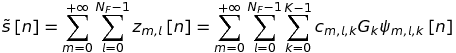
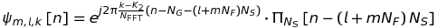
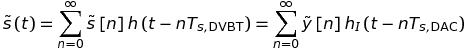
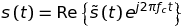
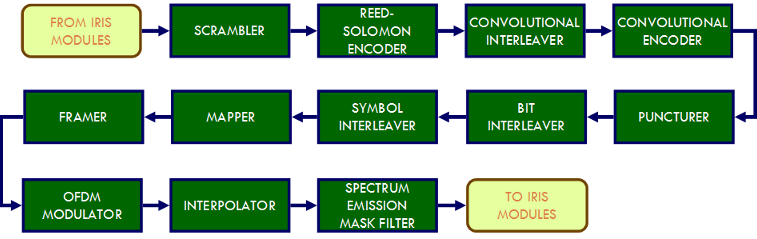
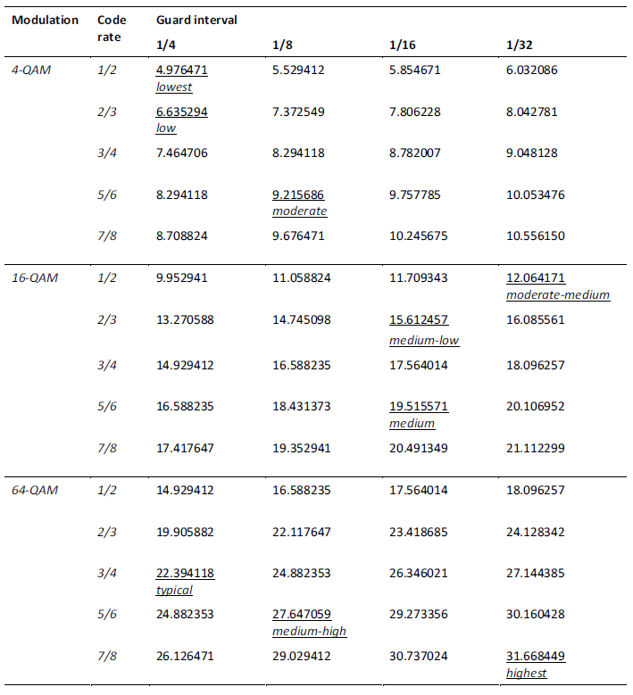
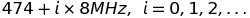
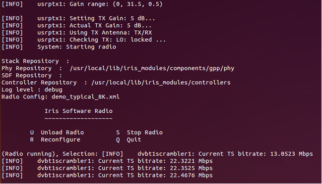
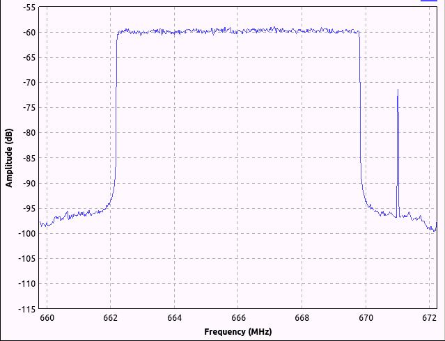

# DVB-TX-IRIS

## Introduction
This package contains the components which may be used to create a
DVB-T broadcasting transmitter with the IRIS software radio framework.
this transmitter can also be controlled by means of the WiSHFUL UPIs.
In the following, we will briefly describe the DVB-T waveform, then we will show
how to download, compile, assemble, operate, and control
the software-defined DVB-T modulator.

### The DVB-T waveform
DVB-T uses orthogonal frequency division multiplexing (OFDM) symbols with
cyclic prefix in order to deliver the transmitted data over the communication
channel. OFDM symbols are grouped in frames (composed of _N<sub>F</sub>_ = 68 OFDM symbols)
and superframes (composed of 4 frames): the superframe can be considered to
represent a basic group of data, as it always carries an integer number of 
transport stream (TS) packets, which constitute the payload of DVB-T and carry
compressed video and audio streams. The base-band (BB) signal samples can be
expressed as

  

where _m_ represents the frame index, _l_ is the OFDM symbol index, _k_ is the 
subcarrier index, _K_ is the number of active carriers (depending on the
transmission mode), and _N<sub>F</sub>_ is the number of OFDM symbols per frame; the data
transported over each carrier is given by _c<sub>m,l,k</sub>_ and it is a QAM (quadrature
amplitude modulation) mapped constellation symbol, carrying _ν_ bits per symbol; 
_G<sub>k</sub>_ is a carrier amplitude weighting factor that can be used to precompensate
linear distortions introduced by the transmitter (_G<sub>k</sub>_ = 1 in case of no
distortions), and _z<sub>m,l</sub>_[_n_] is the OFDM symbol in time. The modulation is performed
using _K_ out of _N<sub>FFT</sub>_ orthogonal carriers _ψ<sub>m,l,k</sub>_[_n_], expressed as



where _K<sub>2</sub>_ = _K_/2, _N<sub>G</sub>_ is the number of samples of the guard interval, 
_N<sub>S</sub>_ = _N<sub>FFT</sub>_ + _N<sub>G</sub>_ is the total number of samples of the OFDM symbol, and _Π<sub>Ns</sub>_[_n_] 
is the boxcar window, which is equal to 1 in [0, _N<sub>S</sub>_ - 1] and to 0 elsewhere.
The BB samples are then converted into the analog domain using a sample time 
_T<sub>s,DVBT</sub>_ that depends on the bandwidth of the DVB-T configuration. The sample
rate _f<sub>s,DVBT</sub>_ = 1/_T<sub>s,DVBT</sub>_, can be replaced by the DAC sample rate
_f<sub>s,DAC</sub>_ = 1/_T<sub>s,DAC</sub>_, as expressed by



where _h_(_t_) = _T<sub>s,DVBT</sub>_, sinc(_πt_/_T<sub>s,DVBT</sub>_) is the ideal BB reconstruction filter,
h<sub>I</sub>(_t_) is the DAC output filter, and _ỹ_[_n_] is the signal _s~_[_n_] resampled to
the DAC sample rate.
Eventually, the analog signal is up-converted, using a quadrature modulator,
to the RF carrier frequency, _f<sub>c</sub>_, as



  
__Fig. 1. DVB-T transmission scheme.__

### IRIS

The DVB-TX-IRIS extension is an extension of the Iris framework. Iris is a
software architecture for building highly reconfigurable radio networks using 
a component-based design. The architecture comprises two repositories - 
Iris_Core and Iris_Modules. Iris_Core contains the core part of the architecture 
such as parsers, managers, and engines. Iris_Modules contain the components 
which can be used to create a software radio such as PHY-layer components and 
radio controllers. The Iris architecture, written in C++, supports all layers 
of the network stack and provides a platform for the development of not only 
reconfigurable point-to-point radio links, but complete networks of reconfigurable 
radios. Individual radios are described using an XML document. This lists the 
components which comprise the radio, gives the values to be used for their 
parameters and describes the connections between them. Iris was originally 
developed by CTVR, The Telecommunications Research Centre, based at University 
of Dublin, Trinity College. In 2013, it was released under the LGPL v3 license 
and is currently managed by Software Radio Systems (http://www.softwareradiosystems.com).

Since DVB-TX-IRIS extends Iris functionalities, there are shared requirements
that should be satisfied from the software point of view. In particular, they are:

* Essential SW
  * Ubuntu Linux OS 32/64 bit (http://www.ubuntu.org), release 14.04 or later
  * CMake 2.6 or later (http://www.cmake.org/), an automated software build and test environment for C/C++
  * Boost 1.46 or later (http://www.boost.org/), an extensive collection of C++ libraries for accelerating common software tasks
  * Iris_Core (http://www.hostedredmine.com/projects/iris_software_radio/wiki), the core system of the Iris framework
  * Iris_Modules (http://www.hostedredmine.com/projects/iris_software_radio/wiki), additional modules for the Iris framework
  * FFTW (http://www.fftw.org/), a powerful C/C++ library for FFT transforms
  * UHD (http://code.ettus.com/redmine/ettus/projects/uhd/wiki), needed for the connection to USRP hardware
* Optional SW
  * Qt 4.8 (http://qt-project.org/), used for building graphical widgets
  * Qwt 6 (http://qwt.sourceforge.net/), used for building graphical widgets
  * Liquid-DSP (https://github.com/jgaeddert/liquid-dsp), for some PHY components
  * Google Protocol Buffers (https://developers.google.com/protocol-buffers/), for some Stack components
  * Python (http://www.python.org/), for the PythonPlotter widget
  * Octave (http://www.octave.org/), for recreating the test vectors used during the testing phase of the build, and for running complete TX/RX simulations
  * Matlab (http://www.mathworks.com/), for the MatlabTemplate PHY component and MatlabPlotter widget
  * Doxygen (http://www.doxygen.org/), for the documentation
  * tzap (dvb-apps package) and w_scan (w-scan package), used for real-time stream quality testing with DVB-T USB receivers

From the hardware point of view, the following items are required:

* Essential HW
  * A workstation or laptop PC equipped with a multicore CPU clocked at 2 GHz or more, 4 GB of RAM, 20 GB of free disk space, and a free Gigabit Ethernet connection
  * An Ettus USRP N210 equipped with an UHF/VHF capable daughterboard (such as the SBX or SBX120)
  * A UHF/VHF antenna (preferably directional antenna for longer communication range)
  * A DVB-T capable receiver (such as a TV set, a set-top box, or an USB dongle, provided with indoor reception antenna)
* Optional HW
  * A spectrum analyzer for verifying the spectrum of the emitted DVB-T signal

## Compilation and installation

Provided that the essential SW requirements are satisfied, the following steps are needed to successfully compile DVB-TX-IRIS:

* The DVB-TX-IRIS code can be downloaded using SVN or GIT from the official GitHub page of the WiSHFUL project, https://github.com/wishful-project. For instance, using subversion, the command is  
<code>svn checkout http://url.to.iris.repository.in.wishful/dvb-tx-iris</code>

* Now cd into the project directory, and create a folder named "build", where the extension will be compiled  
<code>cd dvb-tx-iris</code>  
<code>mkdir build</code>  	
<code>cd build</code>

* Invoke cmake to prepare the build environment  
<code>cmake ..</code>

* Invoke make to build the extension  
<code>make</code>

* Optionally, you can benchmark the speed of the extension components and test their correct operation with  
<code>make benchmark</code>  
<code>make test</code>

* If the previous steps ended with success, now you can install the extension by typing  
<code>sudo make install</code>

* If you want to build also the documentation HTML manual, then you must execute doxygen in the "doc" folder  	
<code>cd ..</code>  
<code>cd doc</code>  
<code>doxygen</code>


## Choosing a bit rate and the transmission parameters
The DVB-T system is designed to convey a constant bit rate payload. Thus, if 
the video and audio sources, after compression, have a bit rate higher or lower
than the expected value, the SDR modulator will fail in delivering an high quality 
stream to the receivers. The connection among bit rates and transmission parameters
is shown in Table I. There, for any combination of modulation, cyclic prefix,
and code rate, there is a corresponding value that should be used to generate 
the TS. We also highlight that the OFDM mode (2K, 8K) does not influence the 
bit rate. Summarizing, the transmission parameters could be chosen according 
to the following guidelines:

* _Cyclic prefix_: this parameter determines the ruggedness of the DVB-T signal 
with respect to RF channel impairments such as multipath and echoes. Choose a 
large value (1/4) if delayed signal echoes are expected, especially when 
covering large areas (width on the order of kms). Differently, the smallest 
value (1/32) is sufficient for a localized transmission covering a range of 
few hundreds of metres.
* _OFDM mode_: as explained before, this parameter does not impact on the payload 
bit rate. However, a 2K OFDM mode is to be preferred if the receivers are 
preferentially of nomadic or mobile type, since in this case the harmful effect 
of the Doppler spread (due to the relative motion of the transmitter and 
receiver) on OFDM carriers orthogonality is minimized. Moreover, 2K is preferred 
for covering relatively small areas. On the other side, 8K can be used when 
covering large areas and the receivers are expected to be of a static, fixed type.
* _Modulation order_: this parameter selects the spectral efficiency of the system,
thus larger modulation orders (64-QAM) will allow higher bit rate payloads to 
be delivered. Concurrently, higher modulation orders also require important 
values of S/N ratio at the receivers, in order to have a successful reception 
of the TV signal. On the other side, smaller modulation orders (4-QAM, 16-QAM) 
have lower requests in terms of S/N ratio, but they are not as spectrally efficient.
* _Code rate_: this is the other parameter that concurs to determine the spectral 
efficiency of the system. High values of code rate (e.g., 7/8) allow very high 
bit rate payloads, but protect less the signal from unwanted interferences. 
Lower code rates (such as 1/2) protect the signal very well from noise and 
other disruptive impairments, but they also lower the spectral efficiency.

__Tab. 1. Bit rate of the selected parameters configurations for testing
(8 MHz DVB-T system, 2K and 8K provide the same bit rate).__

  


We conclude this section by recalling that, anyway, the choice of the bit 
rate depends also on the quality and quantity of the TV programs that will be 
included in the multiplexed TS.

## Choosing frequency, power, gain
These three parameters do not concur in the modification of the payload bit 
rate, but they are important as well.
* _Frequency_: the emission frequency should be chosen in the range that is 
commonly used by TV receivers in the VHF-UHF bands. Choosing an emission 
frequency outside of this range could result in the impossibility to receive 
this signal on common TV receivers. However, it should be noted that an official 
permit of the National or Regional Communications Authority must be accorded 
before broadcasting at such frequencies. The relationship between a DVB-T UHF 
frequency channel _i_ and its central frequency (for 8 MHz systems) is



* _Power_: this parameter decides the power of the digital signal generated by 
the SDR DVB-T modulator. This value can be overridden by applying proper 
amplification gains in the transmission chain, nonetheless it should be chosen
carefully. In fact, a typical value of 30-50 (%) is recommended, since this will 
result in a digital signal with a smaller dynamic range, which will produce 
fewer distortions during the D/A conversion stage (i.e., less clipping noise).
* _Gain_: this parameter is related to the analog amplification stage of the USRP. 
Smaller values (0-5 dB) will result in a scarcely amplified signal, that will 
not cover a large area, but it will be less distorted since the amplifier is 
working in the linear portion of its amplification characteristic curve. 
Higher values (15-20 dB) will allow covering larger areas at the expense of 
the spectral flatness and purity of the emitted RF signal. The highest values 
should be avoided, since the additional emitted power is obtained by operating 
in a highly nonlinear portion of the amplifier characteristic, degrading 
completely the main spectrum and its surrounding frequencies.

## Choosing an input TS file
Once the transmission configuration has been selected, the input TS can be 
chosen among one of those that are already provided for this purpose, and that 
can be downloaded from 

http://dante.diei.unipg.it/~baruffa/WiSHFUL/

These 9 TS files have been generated with a payload bit rate and transmission
parameters configuration that can be extracted directly from the file names.
In case that none of the files above satisfies the selected payload bit rate,
then it is possible to generate a corresponding TS using the OpenCaster and FFmpeg based procedure.
To this purpose, example scripts that can be used to compress and multiplex
the input clips are included in the "_script/dvbt/TS_" folder: there is a batch 
file (*ts_example.bat*) that can be used to generate the program and transport 
streams using the selected compression methods, as well as a python file 
(*ts_example.py*) that cam be used to generate the DVB-T TS tables.

## Preparing an Iris XML file
The chosen transmission configuration (input file and transmission parameters) 
must be specified into an XML document, following the Iris framework XML syntax. 
It is suggested to copy and modify one of the configuration files that are included 
in the "_examples/dvbt_" folder. For instance, the file named "*demo_typical_8K.xml*" 
already contains the configuration parameters necessary to perform the transmission 
of the typical TS. The syntax of the XML file is pretty self-explanatory, and the
values associated to parameters such as OFDM mode, cyclic prefix, code rate, etc., 
can be modified to suit one's needs: during this step, please be advised that 
the same parameters could have to be modified inside of several components/engines.
The following configuration is excerpted from the XML file used to configure 
DVB-TX-IRIS for performing the transmission of the typical TS, "*demo_typical_8K.xml*".

```xml
001 <?xml version="1.0" encoding="utf-8" ?> 
002 
003 <softwareradio name="Radio1">
004
005  <engine name="phyengine1" class="phyengine">
006
007    <component name="filerawreader1" class="filerawreader">
008      <parameter name="filename" value="hd3typ.ts"/>
009      <parameter name="blocksize" value="18800"/>
010      <parameter name="datatype" value="uint8_t"/>
011      <port name="output1" class="output"/>
012    </component>
013
014  </engine>
015  <engine name="phyengine2" class="phyengine">
016  
017    <component name="dvbt1scrambler1" class="dvbt1scrambler">
018      <parameter name="debug" value="false"/>
019      <parameter name="reportinterval" value="5"/>
020      <port name="input1" class="input"/>
021      <port name="output1" class="output"/>
022    </component>
023    
024  </engine>
025  <engine name="phyengine3" class="phyengine">
026  
027    <component name="dvbt1rsencoder1" class="dvbt1rsencoder">
028      <parameter name="debug" value="false"/>
029      <port name="input1" class="input"/>
030      <port name="output1" class="output"/>
031    </component>
032    
033  </engine>
034  <engine name="phyengine4" class="phyengine">
035
036    <component name="dvbt1convinterleaver1" class="dvbt1convinterleaver">
037      <parameter name="debug" value="false"/>
038      <port name="input1" class="input"/>
039      <port name="output1" class="output"/>
040    </component>
041
042  </engine>
043  <engine name="phyengine5" class="phyengine">
044
045    <component name="dvbt1convencoder1" class="dvbt1convencoder">
046      <parameter name="debug" value="false"/>
047      <port name="input1" class="input"/>
048      <port name="output1" class="output"/>
049    </component>
050
051  </engine>
052  <engine name="phyengine6" class="phyengine">
053
054   <component name="dvbt1puncturer1" class="dvbt1puncturer">
055      <parameter name="debug" value="false"/>
056      <parameter name="coderate" value="34"/>
057      <port name="input1" class="input"/>
058      <port name="output1" class="output"/>
059    </component>
060
061  </engine>
062  <engine name="phyengine7" class="phyengine">
063
064    <component name="dvbt1bitinterleaver1" class="dvbt1bitinterleaver">
065      <parameter name="debug" value="false"/>
066      <parameter name="qammapping" value="64"/>
067      <parameter name="hyerarchymode" value="0"/>
068      <port name="input1" class="input"/>
069      <port name="output1" class="output"/>
070    </component>
071
072  </engine>
073  <engine name="phyengine8" class="phyengine">
074
075    <component name="dvbt1symbolinterleaver1" class="dvbt1symbolinterleaver">
076      <parameter name="debug" value="false"/>
077      <parameter name="ofdmmode" value="8192"/>
078      <port name="input1" class="input"/>
079      <port name="output1" class="output"/>
080    </component>
081
082  </engine>
083  <engine name="phyengine9" class="phyengine">
084
085    <component name="dvbt1mapper1" class="dvbt1mapper">
086      <parameter name="debug" value="false"/>
087      <parameter name="qammapping" value="64"/>
088      <parameter name="hyerarchymode" value="0"/>
089      <port name="input1" class="input"/>
090      <port name="output1" class="output"/>
091    </component>
092  
093  </engine>
094  <engine name="phyengine10" class="phyengine">
095
096   <component name="dvbt1framer1" class="dvbt1framer">
097      <parameter name="debug" value="false"/>
098      <parameter name="ofdmmode" value="8192"/>
099      <parameter name="qammapping" value="64"/>
100      <parameter name="hyerarchymode" value="0"/>
101      <parameter name="cellid" value="-1"/>
102      <parameter name="hpcoderate" value="34"/>
103      <parameter name="indepthinterleaver" value="false"/>
104      <parameter name="deltamode" value="4"/>
105      <port name="input1" class="input"/>
106      <port name="output1" class="output"/>
107    </component>
108  
109  </engine>
110  <engine name="phyengine11" class="phyengine">
111
112    <component name="dvbt1ofdmmod1" class="dvbt1ofdmmod">
113      <parameter name="debug" value="false"/>
114      <parameter name="ofdmmode" value="8192"/>
115      <parameter name="deltamode" value="4"/>
116      <parameter name="outpower" value="30"/>
117      <parameter name="dacsamplerate" value="12500000"/>
118      <port name="input1" class="input"/>
119      <port name="output1" class="output"/>
120    </component>
121  
122  </engine>
123  <engine name="phyengine12" class="phyengine">
124
125    <component name="dvbt1interpolator1" class="dvbt1interpolator">
126      <parameter name="debug" value="false"/>
127      <parameter name="insamplerate" value="0"/>
128      <parameter name="outsamplerate" value="12500000"/>
129      <parameter name="responsefile" value="interp.txt"/>
130      <port name="input1" class="input"/>
131      <port name="output1" class="output"/>
132    </component>
133  
134  </engine>
135  <engine name="phyengine13" class="phyengine">
136  
137    <component name="dvbt1filter1" class="dvbt1filter">
138      <parameter name="debug" value="false"/>
139      <parameter name="samplerate" value="12500000"/>
140      <parameter name="attenuation" value="25"/>
141      <parameter name="stopband" value="4500000"/>
142      <port name="input1" class="input"/>
143      <port name="output1" class="output"/>
144    </component>
145
146  </engine>
147  <engine name="phyengine14" class="phyengine">
148
149    <component name="usrptx1" class="dvbt1usrptx">
150      <parameter name="frequency" value="666000000"/>
151      <parameter name="fixlooffset" value="5000000"/>
152      <parameter name="rate" value="12500000"/>
153      <parameter name="streaming" value="false"/>
154      <parameter name="gain" value="10"/>
155      <parameter name="numbuffers" value="4"/>
156      <parameter name="args" value="addr=192.168.10.3"/>
157      <port name="input1" class="input"/>
158    </component>
159
160  </engine>
161
162  <link source="filerawreader1.output1" sink="dvbt1scrambler1.input1" />
163  <link source="dvbt1scrambler1.output1" sink="dvbt1rsencoder1.input1" />
164  <link source="dvbt1rsencoder1.output1" sink="dvbt1convinterleaver1.input1" />
165  <link source="dvbt1convinterleaver1.output1" sink="dvbt1convencoder1.input1" />
166  <link source="dvbt1convencoder1.output1" sink="dvbt1puncturer1.input1" />
167  <link source="dvbt1puncturer1.output1" sink="dvbt1bitinterleaver1.input1" />
168  <link source="dvbt1bitinterleaver1.output1" sink="dvbt1symbolinterleaver1.input1" />
169  <link source="dvbt1symbolinterleaver1.output1" sink="dvbt1mapper1.input1" />
170  <link source="dvbt1mapper1.output1" sink="dvbt1framer1.input1" />
171  <link source="dvbt1framer1.output1" sink="dvbt1ofdmmod1.input1" />
172  <link source="dvbt1ofdmmod1.output1" sink="dvbt1interpolator1.input1" />
173  <link source="dvbt1interpolator1.output1" sink="dvbt1filter1.input1" />
174  <link source="dvbt1filter1.output1" sink="usrptx1.input1" />
175
176</softwareradio>
```

## USRP setup
The USRP device must be connected via Gigabit Ethernet to the host PC where 
Iris and DVB-TX-IRIS are installed. The address of the used USRP device, once 
it is verified to be reachable via ping commands, can be written in the 
configuration file. The compatibility between the device firmware revision and 
the Ettus UHD drivers used to communicate with the USRP should be verified; 
differently, the device will refuse to work. Either a directional or an omni-directional 
antenna can be used to transmit the signal, after taking proper care of the 
USRP device gain value in the XML file.

## Transmit
At this point the RF signal broadcasting can be initiated. The command line to give is

<code>iris -f config.iris demo_typical_8K.xml</code>

or different if the modified file name is different. If the transmission is
proceeding correctly, the command line output should be devoid of USRP 
communication errors ("U" characters are printed in case of buffer under-run, 
typically happening when BB digital samples are not being fed sufficiently fast 
to the USRP) and the SDR modulator should print, periodically, a report of the 
actually processed bit rate: this value should match the theoretical payload bit rate.

  
__Fig. 2. Output of the Iris command line during correct operation.__

  
__Fig. 3. Spectrum of the generated DVB-T signal.__

## Receive and validate
Any standard compliant DVB-T receiver that is in the range covered by the 
transmitting hardware should be able to pick-up and decode the signal. To 
this purpose, a full channel scan should be performed in the receiver's setup 
menu, and one or more TV channels from the WiSHFUL transmission network should 
be now present in the receiver channel list. The same thing can also be carried 
out using a DVB-T USB dongle: by this means, it can be possible also to analyze 
the quality and validate the received signal by a number of parameters such as 
the signal power, the residual bit error rate, the number of uncorrected packets, 
etc.

.")  
__Fig. 4. TV reception of the typical configuration (64-QAM, FEC 3/4, 2K ¼ or 8K ¼).__

Power loading can also be tested: the "_examples/dvbt_" folder already contains 
a demonstration XML configuration file, "*demo_typical_8K_PL_USRP.xml*", as well 
as a pre-computed power profile file, *logo_profile.txt*. Additionally, each user 
can recreate a logo-resembling power profile by running the MATLAB/Octave script
powerload_logo.m, which is saved in the "_scripts/dvbt/MATLAB_" folder

## Off-line validation
This step is not generally required, since if the TV signal is correctly 
received on a TV set, this should be more than sufficient. Anyway, during the 
compilation step, it is possible to carry out a validation of the DVB-TX-IRIS 
module C++ components against a MATLAB/Octave implementation of the same 
component. For every component, there is an associated M-script that can be 
used to generate random input and output test vectors for the specified component 
(the M-script and already generated test vectors are present in the "_test_" folder 
inside the main component folder). During the build process, the _ctest_ command 
triggered during the invocation of "_make test_" executes an automated check of 
the components correct operation: the input test vector is loaded by the 
component and transformed into the respective output vector (as per the 
processing performed by the block); then, the MATLAB output test vector and 
the Iris output test vector are compared. The test passes or fails depending 
on the correspondence between these two test vectors.

## Interaction with the WiSHFUL framework
Since this modulator has been conceived as a WiSHFUL Extension, it is also possible
to control its operation by means of the WiSHFUL tools: thanks to the Patron TCD,
there is special controller module, named _forgecontroller_, that can be instantiated
in the xml file with the following lines

```xml
<controller class="forgecontroller">  
</controller>
```

and that can be used to control some operational parameters of the Iris DVB-T transmitter,
such as the frequency, the amplifier gain, and the output power.
The WiSHFUL controller can be directly used to modify one or more of the three
parameters in a single call to the WiSHFUL framework, together with a local WiSHFUL agent.
In order to start the controller, a specialized Python environment needs to be set-up.
With reference to the WiSHFUL code root folder, the controller and its environment
are started with the following commands

<code>. ./up_controller.sh</code>  
<code>cd examples/iris</code>  
<code>./wishful_simple_controller --config ./controller_config.yaml</code>

In another terminal one can start the slave/agent, with the following commands

<code>. ./up_slaves.sh</code>  
<code>cd examples/iris</code>  
<code>./wishful_simple_agent --config ./agent_config.yaml</code>

Finally, the Iris radio configuration XML file (with the specialized
Iris/WiSHFUL controller) can be loaded and run inside of Iris with the command

<code>iris -f config.iris demo_typical_8K_WiSHFUL.xml</code>

The output of Iris now will contain also the pings emitted by the Iris
controller in charge of talking with the WiSHFUL framework

<pre>
...  
Events Received: 0  
Events Received: 0  
Events Received: 0  
Events Received: 0  
Events Received: 0  
[INFO]    dvbt1scrambler1: Current TS bitrate: 22.4013 Mbps  
Events Received: 0  
Events Received: 0  
...  
</pre>

The controller will fire up when it receives an event from the
WiSHFUL controller (via the WiSHFUL agent). In the controller window,
we can enter the new transmission parameters

<pre>
************************ Wishful Controller  ************************  
*                                                                   *  
************************  Iris Integration   ************************  
Change the frequency: (y/n): y  
Write the frequency: 666000000  
Change the gain: (y/n): y  
Write the gain: 5  
Change the outpower: (y/n): y  
Write the outpower: 50  
New node appeared:  
ID: a58546ee-0d81-45d7-a414-566256572475  
IP: 127.0.0.1  
Name: agent_123  
Info: agent_info  
Modules: {0: 'LocalControlModule', 1: 'IrisModule', 2: 'PyreDiscoveryAgentModule'}  
Module_Functions: {0: ['stop_local_control_program', 'send_msg_to_local_control_program',
'start_local_control_program'], 1: ['set_outpower', 'set_frequency', 'set_rate', 'set_gain']}  
Module_Generators: {}  
Interfaces: {0: 'iris'}  
Iface_Modules: {0: [1]}  
Modules_without_iface: [0, 2]  
Sending parameters. . .  
Waiting return. . .  
2016-11-04 14:31:25.139233 DEFAULT CALLBACK : Group: all, NodeName: agent_123,
Cmd: set_frequency, Returns: ok  
2016-11-04 14:31:25.140457 DEFAULT CALLBACK : Group: all, NodeName: agent_123,
Cmd: set_gain, Returns: ok  
2016-11-04 14:31:25.141196 DEFAULT CALLBACK : Group: all, NodeName: agent_123,
Cmd: set_outpower, Returns: ok  
...  
</pre>

After a while, the WiSHFUL controller has received a positive
confirmation of the change of the transmission parameters. In the same time,
in the Iris output window, the events are received, executed, and confirmed back

<pre>
...  
Events Received: 0  
Received cmd: set:phyengine14.usrptx1.frequency=666000000  
handle_read: Sending ok:  
Received cmd: set:phyengine14.usrptx1.gain=5  
handle_read: Sending ok:  
Received cmd: set:phyengine11.dvbt1ofdmmod1.outpower=50  
handle_read: Sending ok:  
Received Event: (set, phyengine14.usrptx1.frequency=666000000)  
Received Event: (set, phyengine14.usrptx1.gain=5)  
Received Event: (set, phyengine11.dvbt1ofdmmod1.outpower=50)  
Events Received: 3  
[INFO]    usrptx1: Setting TX Frequency: 666MHz...  
[INFO]    usrptx1: LOG TX Frequency: 666MHz  
[INFO]    phyengine14: Reconfigured parameter frequency : 666000000  
[INFO]    usrptx1: Gain range: (0, 31.5, 0.5)  
[INFO]    usrptx1: Setting TX Gain: 5 dB...  
[INFO]    usrptx1: Actual TX Gain: 5 dB...  
[INFO]    phyengine14: Reconfigured parameter gain : 5  
[INFO]    phyengine11: Reconfigured parameter outpower : 50  
Events Received: 3  
Events Received: 3  
[INFO]    dvbt1scrambler1: Current TS bitrate: 22.3485 Mbps  
Events Received: 3  
...  
</pre>

## Bibliography
1. G. Baruffa, L. Rugini, and P. Banelli, _Design and validation of a Software
Defined Radio testbed for DVB-T transmission_, Radioengineering, vol. 23, 
no. 1, pp. 387–398, Apr. 2014.
2. DVB PROJECT. _Digital Video Broadcasting (DVB); Framing structure, channel 
coding and modulation for digital terrestrial television_, ETSI EN 300 744 
V1.6.1 (2009-01). 2009. Available at: http://www.dvb.org. 


